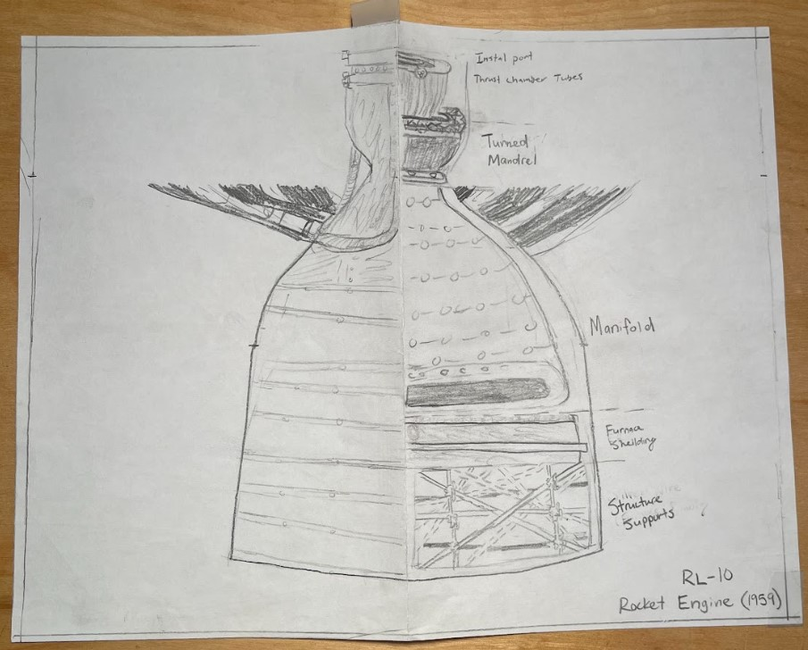

# Tanner Josiah Peck - Engineering and Design Portfolio

### Background 
B.S in Mechanical Engineering, Syracuse University

### Skills
Solidworks, Autodesk Inventor, Onshape, MATLAB, RStudio, NI Multisim, Arduino, Microsoft (Word, Powerpoint, Excel), 
3D Printing, Mechanical Assembly, Machine Lab Trained

---

## Professional Projects & Work Experience 

### * Engineering Internship at Lasko Products, West Chester PA
Managed multiple projects in different divisions of Lasko Products as the sole Engineering Intern

##### - Product Breakdown and Cost Analysis
Took apart and categorized all parts of multiple models of fans, blowers, heaters, and even dehumidifiers to create a detailed cost analysis of the materials used in each model. Each unit was taken apart, and all the materials were weighed, down to the copper in the wiring. 

##### - 2000 CFM Test Chamber
Operated a 2000 CFM Test Chamber developed by Airflow Measurement Systems. Was tasked to correlated results from the chamber with data received from outsourced testing to asses accuracy of the machine. I also wrote an operating procedure for testing Box Fan units on this specific model.

##### - Motor Failure Testing
Ran locked rotary tests on multiple models of fan motors to identify if any models were unsafe when surrounded by a flammable material like insulation. Each motor had the TCU (thermal cutoff) removed, which is the mechanism that shuts down the motor if it gets too hot. 

##### - Heat Rise Testing
Developed and wrote the operating procedure for a Heat-Rise Testing Room. This room was used as a control area to gauge how effective different models of household heaters are at changing the temperature of a room. Soldered and set up thermocouples throughout the room connecting them to a DATAQ analyzer, and ran multiple base tests to asses the sucess of the project.

### * WEB GCS Accessories Project with RedCat Holdings, Salt Lake City UT
Developed field-attachable accessories for a military-grade drone controller, including a secondary display unit, glare-reducing screens, and light-blocking stealth shields

##### - Secondary Display Unit
Developed field-attachable accessories for a military-grade drone controller, including a secondary display unit, glare-reducing screens, and light-blocking stealth shields

##### - Sunshade/Protective Cover
Developed field-attachable accessories for a military-grade drone controller, including a secondary display unit, glare-reducing screens, and light-blocking stealth shields

##### - Directional Antenna
Developed field-attachable accessories for a military-grade drone controller, including a secondary display unit, glare-reducing screens, and light-blocking stealth shields

 

---

## School Projects and Educational Pursuits 

### - Project 1: Linear Inverted Pendulum Control

Implemented LQR state-feedback in MATLAB to control an inverted pendulum on a cart, analyzing stability and performance.

### - Project 2: Fatigue Testing of SLS-Printed Hinges

Used Ansys to simulate fatigue behavior of PA12-polyamide hinges under repeated loading in aerospace mockups.

---
## Personal & Passion Projects

### 3D Printed Projects

#### * Design Based 

##### - Obi-Wan's Lightsaber
Designed in Autodesk Inventor

##### - Luke's Lightsaber
Designed in Autodesk Inventor

##### - Millennium Falcon

Designed in Autodesk Inventor 

##### - 64-Bit Mario
Designed in Autodesk Inventor

---

#### * Downloaded Prints

##### - Han's Blaster
Downloaded the file and printed

##### - Dark Saber
Downloaded the file and printed 

##### - Master Chief Bust
Downloaded the file and printed 

##### - Buddha Darth Vader
Downloaded the file and printed 

##### - Pellet Gun
Downloaded the file and printed 

---

### Other Personal Projects

##### - College Dorm Room Layout
Designed in Onshape

 

##### - Remote Control Door Lock
Created a fully functional, screen-accurate remote control door lock as seen in the 2012 Amazing Spider-Man movie. This lock was a bolt lock powered by a linear actuator and connected to a remote control switch, allowing me to lock and unlock the door without having to move. 

##### - Rocket Design 

---
