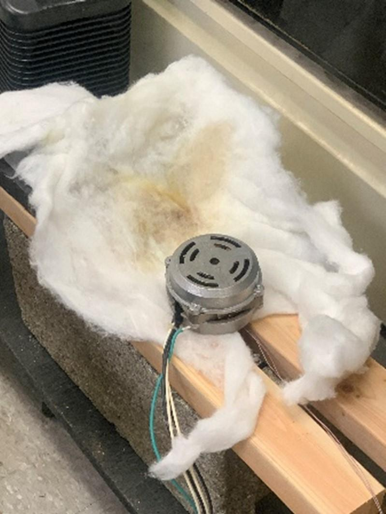

<!-- Hero Section -->

  <h1 class="site-title">Tanner Josiah Peck</h1>
  
Engineering & Design Portfolio

  

    <a href="#work-projects">Work</a>
    <a href="#school-projects">School</a>
    <a href="#personal-projects">Personal</a>
  

# Tanner Josiah Peck - Engineering and Design Portfolio

### Background 
B.S in Mechanical Engineering, Syracuse University

### Skills
Solidworks, Autodesk Inventor, Onshape, MATLAB, RStudio, NI Multisim, Arduino, Microsoft (Word, PowerPoint, Excel), 
3D Printing, Mechanical Assembly, Machine Lab Trained

---

## Professional Projects & Work Experience

### Engineering Internship at Lasko Products, West Chester PA
Managed multiple projects in different divisions of Lasko Products as the sole Engineering Intern

#### Product Breakdown and Cost Analysis  
Took apart and categorized all parts of multiple models of fans, blowers, heaters, and dehumidifiers to create a detailed cost analysis of materials used in each model. Each unit was taken apart, and all the materials were weighed, down to the copper in the wiring.

#### 2000 CFM Test Chamber  
Operated a 2000 CFM Test Chamber developed by Airflow Measurement Systems. Tasked to correlate results from the chamber with data from outsourced testing to assess accuracy. Wrote operating procedures for testing box fan units on this specific model.

#### Motor Failure Testing  
Ran locked rotary tests on multiple fan motor models to identify unsafe models when surrounded by flammable materials like insulation. Removed the TCU (thermal cutoff) mechanism that shuts down the motor if overheating occurs.

#### Heat Rise Testing  
Developed and wrote the operating procedure for a Heat-Rise Testing Room used to gauge effectiveness of household heaters in changing room temperature. Set up thermocouples connected to a DATAQ ana
